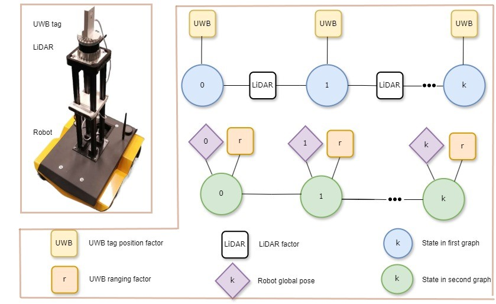
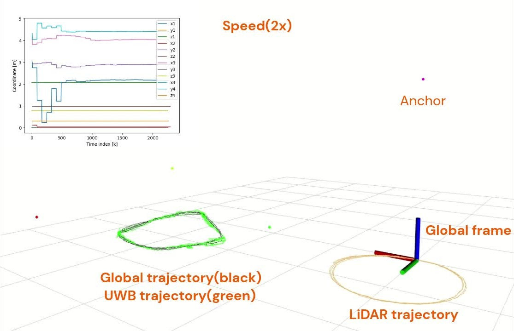

# Simultaneous calibration and localization
## Global calibration for UWB anchor positions with Lidar and UWB
A factor graph-based implementation for UWB anchor global calibration with LiDAR providing local poses and robot localization with UWB, which provides global positions. The imformation fusion of the robot's local pose and the global position is also included to provide a robust robot global pose.

The system framework inclues two factor graphs, one for global fusion, and one for UWB anchor calibration. The detailed results can be found in [our paper](https://arxiv.org/abs/2503.22272).

<!--  -->
<!--  -->
<div style="display:flex; gap:0px;">
  
  
</div>
<br><br>

**More in [video](./results/video.gif).**
<!-- [](./results/video.gif) -->

## 1. Prerequisites
### 1.1 **Ubuntu** and **ROS**
Ubuntu 64-bit 20.04.
ROS Noetic. [ROS Installation](http://wiki.ros.org/ROS/Installation)

### 1.2. **Ceres Solver**
Follow [Ceres Solver Installation](http://ceres-solver.org/installation.html). Tested with version 2.1.0.

### 1.3. **PCL, Eigen and Others**
Follow [PCL Installation](https://pointclouds.org/downloads/#linux), and [Eigen Installation](https://eigen.tuxfamily.org/index.php?title=Main_Page) if needed. Normally, the ones with Ubuntu 20.04 are sufficient.


## 2. Build
We use a modified `A-LOAM` to estimate the local poses and a UWB localization pakcage `uwb_localization_dwm` included in `HR-robot-localization` to get the global positions. Clone this repository, `A-modified-A-LOAM` and `HR-robot-localization`, and catkin_make:

```
    cd ~/catkin_ws/src
    git clone https://github.com/LiuxhRobotAI/Simultaneous_calibration_localization.git

    git clone https://github.com/LiuxhRobotAI/A-modified-A-LOAM.git

    git clone https://github.com/LiuxhRobotAI/HR-robot-localization.git

    cd ../
    catkin_make
    source ~/catkin_ws/devel/setup.bash
```

## 3. UWB calibration
You can run the following commands to get optimal estimations of the UWB anchor's positions.
```
    rosrun global_selfcalibration global_selfcalibration_node
```

You can also run with a ROS bag. The bag data should includes the UWB distance measurements, the UWB tag position, the anchor's initial positions and the corresponding LiDAR poses.
```
    rosbag play DATASET_FOLDER/LIDAR_UWB.bag
```

A useful dataset can be found in this website ([Hugging Face](https://huggingface.co/datasets/liuxh010/IndoorLocalization_UWB_Camera_LiDAR_IMU)).

(Optional) To get the UWB tag position, one can run
```
    roslaunch uwb_localization_dwm localization.launch
```

(Optional) If you have LiDAR cloud points, to get the LiDAR poses
```
    roslaunch aloam_velodyne aloam_velodyne_HDL_32.launch
```

## 4. Acknowledgements
Thanks for [VINS-Fusion](https://github.com/HKUST-Aerial-Robotics/VINS-Fusion), the [updated VINS-Fusion](https://github.com/LiuxhRobotAI/VINS-Fusion), and [A-LOAM](https://github.com/HKUST-Aerial-Robotics/A-LOAM).
For Licenses of the component codes, users are encouraged to read the material of these original projects.

## 5. Related works

We kindly recommend to cite [our paper](https://arxiv.org/abs/2503.22272) if you find this code is useful:

```
@inproceedings{liu2025robust,
  title={Robust simultaneous UWB-anchor calibration and robot localization for emergency situations},
  author={Liu, Xinghua and Cao, Ming},
  booktitle={2025 IEEE International Conference on Systems, Man, and Cybernetics (SMC)},
  pages={4691--4697},
  year={2025},
  organization={IEEE}
}
```